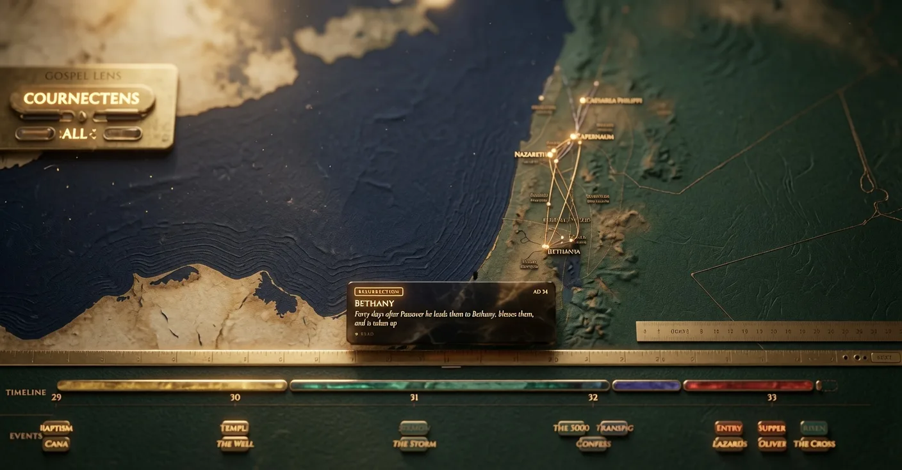
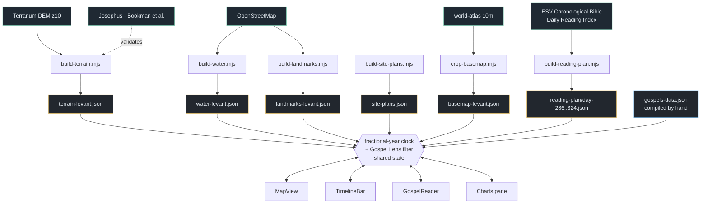

# Jesus's World

An interactive atlas of the Gospels: a D3 map of 26 places across AD 29–33, a
timeline of six periods on progressive disclosure, a charts pane over 55 located
events and 34 parables, and a reader carrying all four Gospels woven into one
chronological sequence. The three surfaces are bound to a single fractional-year
clock — scrub the timeline and routes draw across the map; scroll the reader and
the map pans to the place being described. Terrain, shorelines and town plans are
generated from elevation data and public survey sources by scripts in this repo,
not hand-drawn.

Built to answer a data question rather than a devotional one. Every event in the
Gospels has a *where* and a *when*, and it is told by up to four narrators who
overlap heavily and agree only loosely on order — which is a modelling problem
before it is anything else.



*Placeholder still. The map, timeline and reader are all animated — a demo GIF replaces this.*

**Live → [jesus-world.vercel.app](https://jesus-world.vercel.app)**

---

## What it contains

| Layer | Count | Source |
|---|---|---|
| **Places** | 26 | Named Gospel sites, geocoded |
| **Regions** | 7 | Galilee, Judea, Samaria, Perea, Iturea & Trachonitis, Decapolis, Phoenicia — drawn along real coastline and river geometry |
| **Periods** | 6 | Ministry phases spanning AD 29 – 33.4 |
| **Landmark events** | 16 | The progressive-disclosure tier between period and full detail |
| **Located events** | 55 | 34 miracles · 9 encounters · 7 teachings · 5 turning points |
| **Parables** | 34 | Classified across seven themes. Deliberately *not* placed on the map — see below |
| **Reader** | 39 days · 89 chapters · 3,754 verses | All four Gospels, sequenced chronologically |

**The details that would have made it wrong:**

- **The 55 located events *contain* the 34 miracles.** They are not two separate
  tallies. Charts that add them reach 89 events and overstate the corpus by 62%.
- **The reader holds 3,754 verses, not the 3,779 in the four Gospels.** The 25
  absent ones are Mark 16:9–20, John 7:53–8:11 and Mark 11:26 — see
  [Methodology](#methodology-and-limits). This is fidelity to a source, not an
  omission, and the round number is the one that would have been wrong.
- **Two of the seven regions were not Herodian.** Decapolis was a league of
  autonomous cities and Phoenicia belonged to Syria, so they are described as
  historical regions rather than as a tetrarchy.
- **Routes are styled differently over land and over sea**, because a straight
  line across the Sea of Galilee and a road through Samaria are not the same
  claim about how someone travelled.
- **Parables are charted but never mapped.** Most have no firm location, and
  putting them on the map would manufacture a precision the text does not
  support. They live in a separate thematic array for that reason.
- **Time is stored as a fractional year**, with a day at ≈0.00274 yr. That is
  what lets Passion Week and the Resurrection carry day-level positions on the
  same axis as a four-year ministry, without a second time model.

---

## Architecture



The important edge is the one pointing **both ways**. The map, timeline, reader and
charts do not talk to each other — each reads and writes the same fractional-year value,
so adding a fourth surface costs one subscription rather than three new pairwise
syncs. The Gospel Lens source filter works the same way: it is global state, so
switching to John on the map filters the charts without either component knowing
the other exists.

---

## Quickstart

```bash
npm install
npm run dev
```

The app runs entirely on committed data — no API keys, no accounts, no network
calls at runtime.

Regenerating the data layers is optional and needs network access:

```bash
# elevation tiles, cached under scripts/.terrain-cache/
node scripts/build-terrain.mjs

# inland water; --refetch bypasses the cache
node scripts/build-water.mjs

# the 39-day chronological reading plan
node scripts/build-reading-plan.mjs
```

---

## Using it

- **The timeline is a scrubber, not a legend.** Drag it and routes extend across
  the map in step, so a journey reads as something that took time rather than as
  a finished line.
- **Detail opens in tiers.** Periods first, then the sixteen landmark events, then
  full drill-down — because showing 55 events at once on a four-year span puts
  three years of Capernaum activity into an unreadable stack.
- **Drill into a period and each place gets its own thread**, so repeated visits
  to one town accumulate in a single row instead of scattering down the timeline.
- **Press Play and the map pans with the protagonist**, with a caption card
  narrating each stop from its waypoint note. The arc is four years long; watching
  it is faster than reconstructing it.
- **The Gospel Lens filters everything at once.** Switch to John and the map,
  timeline and charts all follow, which is what makes John's independence visible
  rather than a claim you are asked to accept.
- **The reader pans the map as you scroll**, at finer resolution than a day. The
  final day moves through Emmaus, Thomas, the shore, the commission and the
  ascension, and the map travels all five.
- **Inside Jerusalem the map crossfades to a schematic city plan**, because one
  "Jerusalem" pin cannot tell you whether you are in the temple, the upper room or
  the garden.

---

## Data shape

Everything the app renders comes from `src/data/gospels-data.json`:

```jsonc
{
  "dateRange": [29, 33.4],        // fractional years; the shared clock's domain
  "cities":    [ /* 26 */ ],      // id, name, lat/lon, significance
  "journeys":  [ /* 6  */ ],      // the periods; each holds an ordered stop list
  "books":     [ /* 16 */ ],      // landmark events — the middle disclosure tier
  "churchEvents": [ /* 55 */ ],   // located events
  "parables":  [ /* 34 */ ],
  "provinces": { "regions": [ /* 7 */ ] }
}
```

Events carry `category` (`miracle` · `encounter` · `teaching` · `event`),
`miracleType` where it applies, a `gospels` attestation array, and a `cityId`
joining them to the map.

**The key names are inherited, and the file says so.** This app shares a rendering
engine with its sister project *Paul's World*, so `journeys` means ministry
periods, `books` means landmark events, and `churchEvents` means per-site event
tracks. The names were kept rather than renamed so the data stays drop-in for that
engine — a deliberate trade of schema elegance for one less divergence to
maintain. `gospels-data.json` carries the mapping in its own `_readme`.

The reader is split per day under `src/data/reading-plan/day-286.json` …
`day-324.json`, each holding sections with a citation, a `cityId`, a `year`, and
the verse text itself.

---

## Project layout

```
scripts/
  build-terrain.mjs      contours from elevation tiles; validates its own output
  build-water.mjs        inland water; shoreline reconstructions and their notes
  build-landmarks.mjs    extant surveyed structures, drawn at true size
  build-site-plans.mjs   schematic town plans — sourced footprints, illustrative grids
  build-reading-plan.mjs the 39-day chronological weave
  crop-basemap.mjs       trims world-atlas 10m to the Gospels theatre
src/
  data/                  ALL GENERATED. Fix the script, re-run; never hand-edit.
  components/MapView     the D3 map
  components/TimelineBar the six-period scrubber and its disclosure tiers
  components/GospelReader the scroll-driven four-Gospel read
  components/StoryLayer  Play mode — pan, caption, progressive route reveal
  components/JerusalemDiagram  the city crossfade
pw-test.mjs              Playwright screenshot capture, not a test suite
```

---

## Methodology and limits

**The chronology is not mine, and it is not the only one.** The reader's sequence
is days 286–324 of the printed Daily Reading Index in Crossway's *ESV Chronological
Bible*. Harmonising four accounts into one order requires judgement calls that
serious scholars make differently; this app commits to one published harmony and
does not pretend it is settled.

The AD 29–33 span is likewise a position, not a fact. It follows a common
reconstruction: baptism around AD 29, four Passovers (John 2:13; 5:1; 6:4; 11:55),
and the crucifixion on Friday 14 Nisan = 3 April AD 33. Read the Passovers
differently and the ministry is shorter; the map and timeline would both change
shape. The reconstruction is stated in the data file rather than buried in the
rendering.

**Where the plan and the canon disagree, the plan wins — visibly.** It brackets
Mark 16:9–20 and John 7:53–8:11 as additional reading and skips Mark 11:26 in
silence. All three are passages the critical texts omit. That is why the reader
carries 3,754 verses rather than 3,779, and it is recorded here rather than
quietly corrected.

**Two terrain reconstructions failed, and neither ships.** The build script
generates ancient shorelines from elevation data and then checks its own output
against a measurement before emitting it:

- *The Dead Sea's antique −395 m shoreline.* The lake surface reads −415 m in this
  DEM and the west shore is a cliff, so the −395 m band is a few pixels wide. Even
  at full resolution it returns scattered two-point scraps along the north-east
  shore rather than one ring. This needs a finer DEM (z12+) or a proper lake mask.
- *Lake Huleh, ~+70 m.* Drained in the 1950s and absent from modern datasets. An
  elevation threshold cannot find it, because the valley floor either side sits at
  much the same height — asking for the contour returns a 7 × 23 km sheet, which is
  the valley. The check is Josephus, *War* 3.515: sixty furlongs by thirty, about
  11 × 5.5 km. The best candidate misses that badly, so the script emits the reason
  instead of a plausible-looking wrong shape.

**The town plans are part survey, part illustration, and say which is which.**
Footprints and named landmarks are sourced and cited; street grids and blocks are
drawn for legibility and are not archaeology. `site-plans.json` carries that
distinction in its own header.

**What this is not.** It is not a critical edition, a commentary, or a scholarly
apparatus. It does not merge the accounts: where Matthew, Mark and Luke describe
the same moment they sit adjacent — one event seen three ways — and where they
differ they stay distinct, because flattening them would destroy the thing most
worth looking at.

---

## Data sources

| Source | Used for | Access |
|---|---|---|
| [Terrarium elevation tiles](https://registry.opendata.aws/terrain-tiles/) (z10, ~150 m/px) | Terrain contours, hillshade, shoreline attempts | Public, no key |
| [OpenStreetMap](https://www.openstreetmap.org/copyright) (ODbL) | Modern water bodies, landmark footprints | Public, no key |
| [world-atlas](https://github.com/topojson/world-atlas) 10m | Basemap coastlines and borders | npm |
| Bookman et al. 2004, *Late Holocene lake levels of the Dead Sea* | Dead Sea level history | Published |
| Josephus, *The Jewish War* 3.515 | Lake Huleh dimensional check | Public domain |
| Crossway, *ESV Chronological Bible* — Daily Reading Index | The 39-day chronological sequence | Printed volume, transcribed |
| World English Bible | Verse text | Public domain |

All generated layers are committed, so the app runs with no network access and no
API keys.
